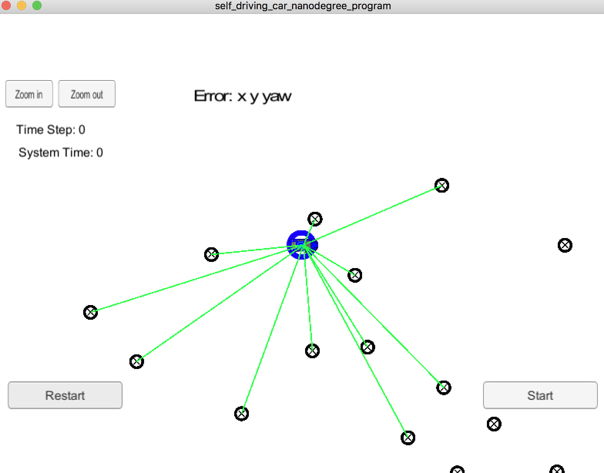
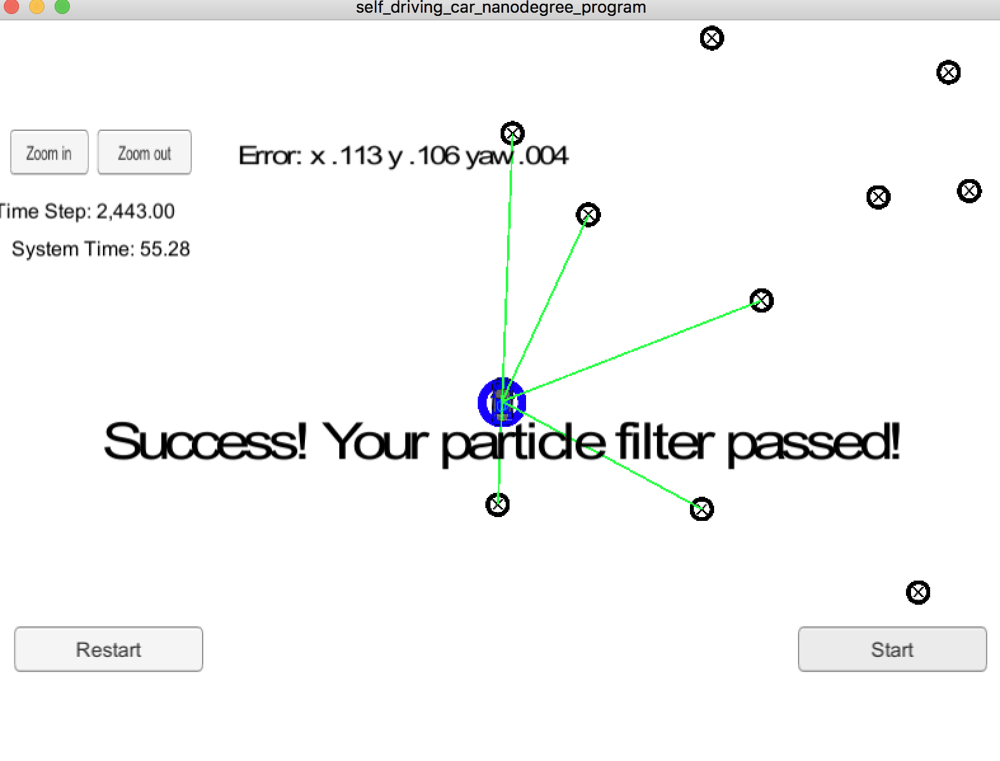

# Overview

It is an easy task for human driver to identify the location of the vehicle and the sourounding objects around the vehicle. Human has no problem in knowing which way to go while driving. On the other hand, self-driving car is not smart like human. In order to know which way to go, self-driving car have to learn the sourounding environment, identify the objects, streets, and may be drive way and all other criterias. First of all, self-driving car has to know the current location of itself in the world. Start with where it is, how self-driving car know where it is currently in the world. To solve this problem, self-driving car rely on GPS, maps, and sensors to calculate and provide its current location in order to proccess other tasks. Particle filter is a technology that is used to identify the current location of the vehicle. This technology is fast, reliable, and easy to implement and it provide the accurate the location of the vehicle. 

## Project Introduction
Your robot has been kidnapped and transported to a new location! Luckily it has a map of this location, a (noisy) GPS estimate of its initial location, and lots of (noisy) sensor and control data.

In this project you will implement a 2 dimensional particle filter in C++. Your particle filter will be given a map and some initial localization information (analogous to what a GPS would provide). At each time step your filter will also get observation and control data. 

## Running the Code
This project involves the Term 2 Simulator which can be downloaded [here](https://github.com/udacity/self-driving-car-sim/releases)

This repository includes two files that can be used to set up and intall uWebSocketIO for either Linux or Mac systems. For windows you can use either Docker, VMware, or even Windows 10 Bash on Ubuntu to install uWebSocketIO.

Once the install for uWebSocketIO is complete, the main program can be built and ran by doing the following from the project top directory.

1. mkdir build
2. cd build
3. cmake ..
4. make
5. ./particle_filter

Alternatively some scripts have been included to streamline this process, these can be leveraged by executing the following in the top directory of the project:

1. ./clean.sh
2. ./build.sh
3. ./run.sh

From the `build` directory, execute `./particle_filter`. The output should be:

```
Listening to port 4567
Connected!!!
```


# Project Structure
The directory structure of this repository is as follows:

```
root
|   build.sh
|   clean.sh
|   CMakeLists.txt
|   README.md
|   run.sh
|
|___data
|   |   
|   |   map_data.txt
|___src
    |   helper_functions.h
    |   main.cpp
    |   map.h
    |   particle_filter.cpp
    |   particle_filter.h
|___images
    |   image1.png
    |   image2.png
    |   image3.png
```

## Inputs to the Particle Filter
You can find the inputs to the particle filter in the `data` directory. 

#### The Map*
`map_data.txt` includes the position of landmarks (in meters) on an arbitrary Cartesian coordinate system. Each row has three columns
1. x position
2. y position
3. landmark id

### All other data the simulator provides, such as observations and controls.

> * Map data provided by 3D Mapping Solutions GmbH.

## Output of the Particle Filter

The following is an image of the simulator:

Here is initialized simulator before running against dataset:
<kbd>

</kbd>

---

Here is the simulator final state after running the particle filter:

<kbd>

</kbd>

---
